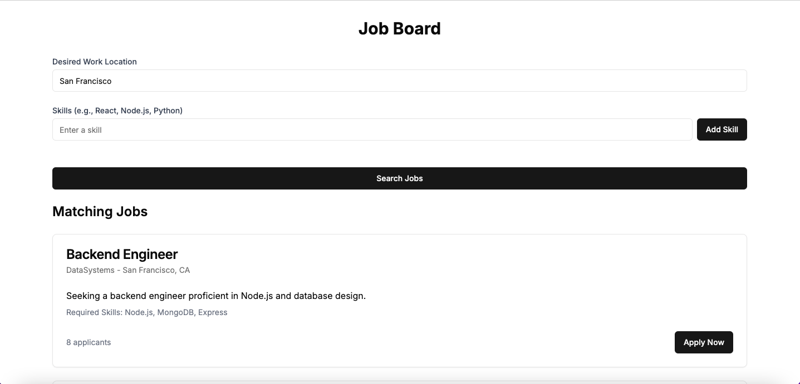

# Job Board App

A React.js and Next.js application styled with Tailwind CSS that helps users find job listings based on their desired work location and skill set. Users input their location and skills, use a slider to indicate their years of experience, and view matching job listings with job details and applicant count. The "Apply Now" button opens a modal for entering information, with a disabled submit button for future enhancements.

## Table of Contents

- [Technologies](#technologies)
- [Setup Instructions](#setup-instructions)
- [Features](#features)
- [Screenshots](#screenshots)
- [Live Demo](#live-demo)
- [Contact](#contact)

## Technologies

- React.js, Next.js, Tailwind CSS


## Setup Instructions

1. Clone the repository:

   ```bash
   git clone https://github.com/ibsaajadam/job-board-app
   ```

2. Navigate to the project directory:

   ```bash
   cd job-board-app
   ```

3. Install dependencies:

   ```bash
   npm install
   ```

4. Start the development server:

   ```bash
   npm run dev
   ```

   The app will now be running at `http://localhost:3000`.

## Features

- **Location Input:** Users can enter their preferred work location.
- **Skills Input & Experience Slider:** Users can add skills and use a slider to indicate years of experience (1-5+ years).
- **Job Listings:** Displays matching job listings with title, description, location, and the number of applicants.
- **Apply Now Modal:** Allows users to open a modal to apply for the job (submit functionality to be implemented).

## Screenshots

  

## Live Demo

View the live demo here: [Live Demo](#)

## Contact

Created by [Ibsaa J Adam](https://github.com/ibsaajadam) - feel free to contact me!

You can also find me on:

- [LinkedIn](https://www.linkedin.com/in/ibsaajadam/)
- [GitHub](https://github.com/ibsaajadam)
